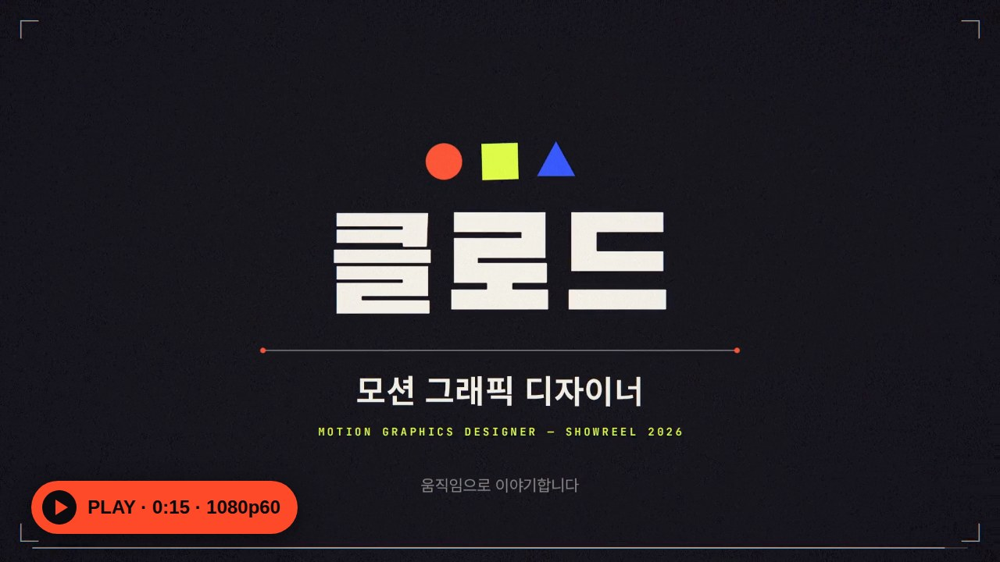
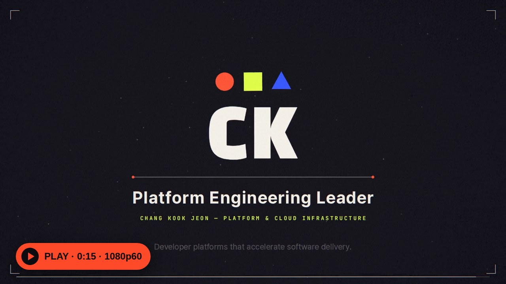

# learn

## 🎬 [Claude 모션 쇼릴 2026](showreel/)

15초 한글 모션그래픽 쇼릴. 영상과 사운드를 모두 코드로 만들었습니다.

▶ [영상 보기](https://aiusecases.metacog.co.kr/docs/usecases/media/code-motion-showreel-claude-code/showreel.mp4) · ⬇ [MP4 다운로드 (17MB)](https://github.com/jeonck/learn/raw/main/showreel/dist/showreel.mp4) · [만든 방법](showreel/README.md) · [프롬프트 템플릿](showreel/README.md#비슷한-영상을-만들기-위한-프롬프트-템플릿)

## 🇺🇸 [CK Jeon — Platform Engineering Reel](showreel/README.en.md)

같은 엔진으로 만든 영문 경력 쇼릴. 15-second career reel built from my resume.

▶ [Watch the reel](https://aiusecases.metacog.co.kr/docs/usecases/media/code-motion-showreel-claude-code/showreel-en.mp4) · ⬇ [Download MP4 (18MB)](https://github.com/jeonck/learn/raw/main/showreel/dist/showreel-en.mp4) · [English README](showreel/README.en.md)

📘 제작 과정 유스케이스: [Claude Code로 15초 한글 모션그래픽 쇼릴 만들기 — AI Usecases](https://aiusecases.metacog.co.kr/docs/usecases/media/code-motion-showreel-claude-code/)
환경 점검부터 스틸 검수, 용량 문제 해결까지 단계별 캡처와 실제 소요 시간으로 정리했습니다.
