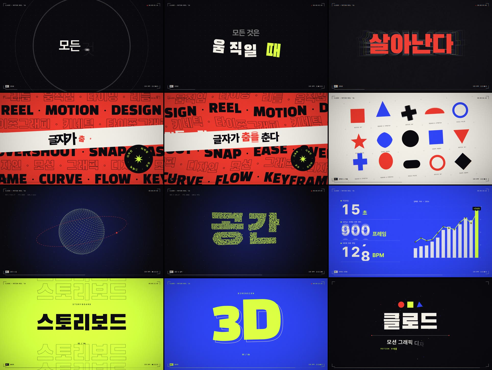
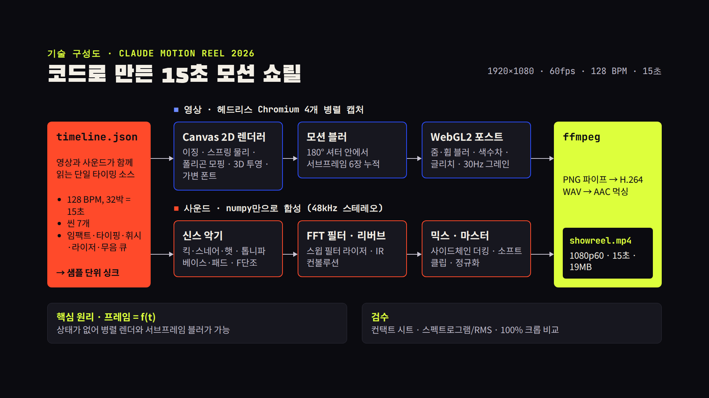

# Claude 모션 쇼릴 2026

15초, 1920×1080, 60fps 한글 모션그래픽 쇼릴. 영상과 사운드를 모두 코드로 만들었다.

[](https://github.com/jeonck/learn/blob/main/showreel/dist/showreel.mp4)

▶ [영상 보기](https://github.com/jeonck/learn/blob/main/showreel/dist/showreel.mp4) · ⬇ [MP4 다운로드 (19MB)](https://github.com/jeonck/learn/raw/main/showreel/dist/showreel.mp4) · 📘 [제작 과정 유스케이스](https://aiusecases.metacog.co.kr/docs/usecases/media/code-motion-showreel-claude-code/)



## 구성 (128 BPM, 4박 = 1.875초 단위)

| 시간 | 섹션 | 보여주는 기술 |
| --- | --- | --- |
| 0.00–3.75 | 00 인트로 | 비트에 맞춰 퍼지는 링, 커서가 된 점, 가변 폰트 굵기 애니메이션(100→800), 스프링 플라이인, 슬램 + 에코, 아이리스 전환 |
| 3.75–5.63 | 01 키네틱 타이포그래피 | 비트에 스냅하는 계단형 마퀴, 사인파 웨이브·스큐, 원형 텍스트 배지 |
| 5.63–7.50 | 02 셰이프 & 리듬 | 슬라이스 와이프, 폴리곤 모핑, 스쿼시 & 스트레치, 오버슈트 회전, 중앙 원 아이리스 |
| 7.50–9.38 | 03 공간 & 깊이 | 2,000개 점의 3D 구 → 토러스 → "공간" 글자 모핑, 원근 투영, 깊이 색상 |
| 9.38–11.25 | 04 데이터 시각화 | 휩 팬, 오도미터 카운터, 스프링 막대 차트, 라인 드로잉 + 값 트래커 |
| 11.25–13.13 | 05 몽타주 | 8분음표 컷 6개(스택·에코·스플릿·스트라이프), 16분음표 스터터, 한 칸의 정적 |
| 13.13–15.00 | 06 엔드 카드 | 충격파 + 파티클 버스트, 블록 리빌, 로고 마크, 타이핑 |

## 파이프라인



```
src/timeline.json ──┬─► src/reel.js ─► (서브프레임 6장 누적 = 모션 블러) ─► src/post.js (WebGL)
  BPM·씬·큐 공유    │        헤드리스 Chromium 4개가 병렬로 프레임 캡처 ─► ffmpeg ─► out/video.mp4
                    └─► scripts/audio.py (numpy 신스) ─► out/audio.wav ─────────────┴─► dist/showreel.mp4
```

- **모든 프레임은 시간 t의 순수 함수** — 상태가 없어서 병렬 렌더와 서브프레임 모션 블러가 가능하다.
- **소리와 그림이 같은 큐를 읽는다** — 임팩트, 글자 타이핑 틱, 휘시, 라이저, 무음 구간이
  `timeline.json` 한 곳에서 정의되어 샘플 단위로 맞는다.
- **포스트 프로세싱** — 줌/방향 블러, 색수차, 글리치, 플래시, 비네팅, 30Hz 필름 그레인.

## 빌드

```bash
npm install            # 폰트(Pretendard, Black Han Sans, JetBrains Mono) + Playwright
pip install numpy imageio-ffmpeg   # 시스템 ffmpeg가 있으면 imageio-ffmpeg는 생략 가능
npm run build          # 사운드 → 렌더 → 인코딩 → dist/showreel.mp4 (4코어 기준 ~12분)
```

그 밖에:

```bash
npm run preview                              # 브라우저 실시간 재생 (클릭하면 사운드)
node scripts/render.mjs --stills 4.2,9.1     # 특정 시점 스틸 → out/stills/
bash scripts/sheet.sh 이름 2x2 4.2,9.1,11,14  # 검수용 컨택트 시트 → out/sheet-이름.png
npm run audio                                # 사운드만 다시 합성
```

Playwright용 Chromium은 따로 받지 않고 시스템에 설치된 것을 쓴다
(`PLAYWRIGHT_SKIP_BROWSER_DOWNLOAD=1 npm install`).

## 비슷한 영상을 만들기 위한 프롬프트 템플릿

필수 키워드는 없다. 대신 아래 여섯 범주를 채울수록 결과가 의도에 가까워진다.

| 범주 | 키워드 예시 |
| --- | --- |
| 결과물 스펙 | `15초`, `1920×1080`, `60fps`, `MP4`, `사운드 포함`, `한글 버전` |
| 용도와 수준 | `이력서용 쇼릴`, `포트폴리오`, `전력을 다해` |
| 연출 | `키네틱 타이포그래피`, `셰이프 모핑`, `3D 파티클`, `데이터 시각화`, `몽타주`, `매번 다른 트랜지션`, `이징·스프링·모션 블러` |
| 리듬과 사운드 | `BPM 128`, `비트 싱크 편집`, `임팩트`, `라이저`, `드롭`, `정적 한 박` |
| 스타일 | `다크 톤`, `팔레트 3~4색 지정`, `폰트 지정`, `필름 그레인`, `HUD 오버레이` |
| 작업 방식과 검증 | `코드로 생성`, `스틸 컷을 렌더해 직접 보고 고쳐줘`, `repo에 커밋` |

가장 효과가 큰 한 줄은 "스틸 컷을 렌더해 직접 보고 고쳐줘"다. 이 쇼릴도 그 확인 과정에서
"공간" 점 글자가 읽히지 않는 문제와 파일 용량 문제를 찾아 고쳤다.

```
[용도]용 [길이]초 [언어] 모션그래픽 [쇼릴]을 만들어줘.
- 스펙: 1920×1080, 60fps MP4, 사운드 포함
- 리듬: [BPM] 비트에 컷·효과·사운드를 맞춰서
- 구성: 키네틱 타이포 → 셰이프 모핑 → 3D → 데이터 시각화 → 몽타주 → 엔드 카드
- 트랜지션은 매번 다르게, 이징·스프링·모션 블러로 움직임 품질을 높게
- 스타일: [배경 톤], 팔레트 [색1, 색2, 색3], 폰트 [폰트명]
- 엔드 카드 문구: [이름 / 직함 / 한 줄 소개]
- 코드로 생성하고, 중간에 스틸 컷을 렌더해서 직접 검수하고 고쳐줘
- 완성되면 repo에 커밋하고 README에 영상 링크 추가
전력을 다해서.
```

대괄호 칸 중 이름·직함·문구는 꼭 채우는 게 좋다. 비워 두면 모델이 임의로 정한다
(이 쇼릴의 엔드 카드 "클로드 / 모션 그래픽 디자이너"가 그렇게 정해졌다).
