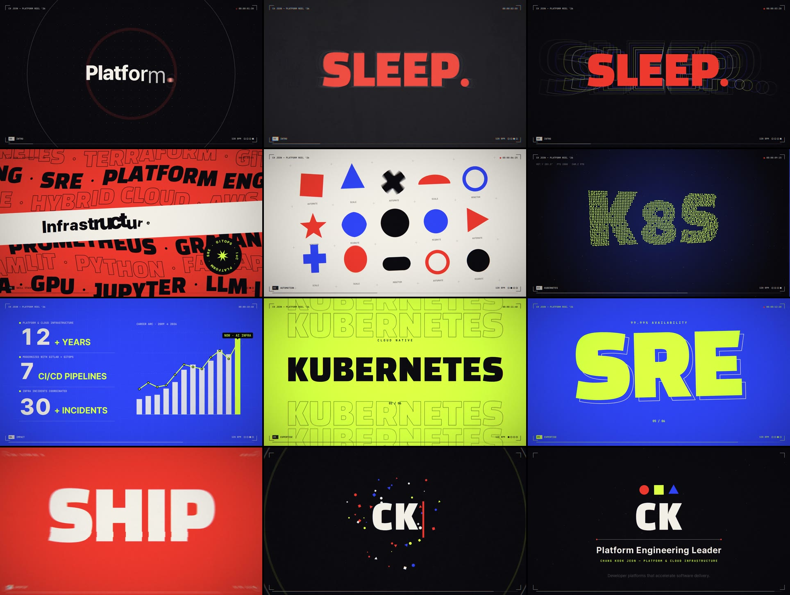

# Claude 모션 쇼릴 2026

15초, 1920×1080, 60fps 한글 모션그래픽 쇼릴. 영상과 사운드를 모두 코드로 만들었다.

🇺🇸 [English README — CK Jeon career reel](README.en.md)

[](https://aiusecases.metacog.co.kr/docs/usecases/media/code-motion-showreel-claude-code/showreel.mp4)

▶ [영상 보기](https://aiusecases.metacog.co.kr/docs/usecases/media/code-motion-showreel-claude-code/showreel.mp4) · ⬇ [MP4 다운로드 (17MB)](https://github.com/jeonck/learn/raw/main/showreel/dist/showreel.mp4) · 📘 [제작 과정 유스케이스](https://aiusecases.metacog.co.kr/docs/usecases/media/code-motion-showreel-claude-code/)


## English version — CK Jeon career reel

같은 엔진에 `src/content.en.json` 만 바꿔 끼운 영문판. 이력서의 사실만 쓴다 — 12+ years, 99.99% availability,
7 CI/CD pipelines modernized, 30+ infra incidents coordinated, 핵심 기술 스택, 2009 → 2026 경력 흐름.
공개 저장소라 연락처(전화·이메일·주소)와 체류 자격은 넣지 않았다.

[](https://aiusecases.metacog.co.kr/docs/usecases/media/code-motion-showreel-claude-code/showreel-en.mp4)

▶ [영상 보기](https://aiusecases.metacog.co.kr/docs/usecases/media/code-motion-showreel-claude-code/showreel-en.mp4) · ⬇ [MP4 다운로드 (18MB)](https://github.com/jeonck/learn/raw/main/showreel/dist/showreel-en.mp4) · 🇺🇸 [English README](README.en.md) · 📘 [영문판 제작 과정 (AI Usecases)](https://aiusecases.metacog.co.kr/docs/usecases/media/code-motion-showreel-claude-code/#english-career-reel)



```bash
npm run draft -- --content content.en.json   # 초안 → out/draft-en.mp4 (약 80초)
npm run build -- --content content.en.json   # 최종 → dist/showreel-en.mp4
```

## 구성 (128 BPM, 4박 = 1.875초 단위)

| 시간 | 섹션 | 보여주는 기술 |
| --- | --- | --- |
| 0.00–3.75 | 00 인트로 | 비트에 맞춰 퍼지는 링, 커서가 된 점, 가변 폰트 굵기 애니메이션(100→800), 스프링 플라이인, 슬램 + 에코, 아이리스 전환 |
| 3.75–5.63 | 01 키네틱 타이포그래피 | 비트에 스냅하는 계단형 마퀴, 사인파 웨이브·스큐, 원형 텍스트 배지 |
| 5.63–7.50 | 02 셰이프 & 리듬 | 슬라이스 와이프, 폴리곤 모핑, 스쿼시 & 스트레치, 오버슈트 회전, 중앙 원 아이리스 |
| 7.50–9.38 | 03 공간 & 깊이 | 2,000개 점의 3D 구 → 토러스 → "공간" 글자 모핑, 원근 투영, 깊이 색상 |
| 9.38–11.25 | 04 데이터 시각화 | 휩 팬, 오도미터 카운터, 스프링 막대 차트, 라인 드로잉 + 값 트래커 |
| 11.25–13.13 | 05 몽타주 | 8분음표 컷 6개(스택·에코·스플릿·스트라이프), 16분음표 스터터, 한 칸의 정적 |
| 13.13–15.00 | 06 엔드 카드 | 충격파 + 파티클 버스트, 블록 리빌, 로고 마크, 타이핑 |

## 파이프라인


```
src/timeline.json ──┬─► src/reel.js ◄── src/content.json (문구·색·수치)
                    │   src/reel.js ─► (서브프레임 6장 누적 = 모션 블러) ─► src/post.js (WebGL)
  BPM·씬·큐 공유    │        헤드리스 Chromium 4개가 병렬로 프레임 캡처 ─► ffmpeg ─► out/video.mp4
                    └─► scripts/audio.py (numpy 신스) ─► out/audio.wav ─────────────┴─► dist/showreel.mp4
```

- **모든 프레임은 시간 t의 순수 함수** — 상태가 없어서 병렬 렌더와 서브프레임 모션 블러가 가능하다.
- **소리와 그림이 같은 큐를 읽는다** — 임팩트, 글자 타이핑 틱, 휘시, 라이저, 무음 구간이
  `timeline.json` 한 곳에서 정의되어 샘플 단위로 맞는다.
- **포스트 프로세싱** — 줌/방향 블러, 색수차, 글리치, 플래시, 비네팅, 30Hz 필름 그레인.

## 빌드

```bash
npm install            # 폰트(Pretendard, Black Han Sans, JetBrains Mono) + Playwright
pip install numpy imageio-ffmpeg   # 시스템 ffmpeg가 있으면 imageio-ffmpeg는 생략 가능
npm run draft          # 초안: 960×540·30fps·서브프레임 1장 → out/draft.mp4 (약 1분)
npm run build          # 최종: 1080p60·서브프레임 6장·CRF 21 → dist/showreel.mp4 (약 12분)
```

두 명령 모두 사운드 합성 → 렌더 → 인코딩 + 오디오 먹싱을 **한 번의 인코딩**으로 끝낸다.
수정할 때는 초안으로 확인하고, 최종 렌더는 마지막에 한 번만 돌린다.

| 작업 | 명령 | 4코어 실측 |
| --- | --- | --- |
| 전체 초안 (사운드 포함) | `npm run draft` | 62초 |
| 한 장면만 초안 | `node scripts/render.mjs --scene space --draft --audio out/audio.wav` | 20초 |
| 한 장면만 최종 품질 | `node scripts/render.mjs --scene type --audio out/audio.wav` | 59초 |
| 전체 최종 | `npm run build` | 약 12분 |

장면 id 는 `timeline.json` 의 `scenes` (intro, type, shape, space, data, montage, end).

그 밖에:

```bash
npm run preview                                      # 브라우저 실시간 재생 (클릭하면 사운드)
node scripts/render.mjs --stills 4.2,9.1 [--draft]   # 특정 시점 스틸 → out/stills/
bash scripts/sheet.sh 이름 2x2 4.2,9.1,11,14 --draft  # 저해상도 컨택트 시트 → out/sheet-이름.png
npm run audio                                        # 사운드만 다시 합성
```

## 내용 바꾸기 — `src/content.json`

문구·팔레트·수치는 코드가 아니라 `src/content.json` 에 있다. 다른 영상을 만들 때는 이 파일부터 고친다.

| 키 | 내용 |
| --- | --- |
| `palette` | 색 5개. 이름은 역할 자리다 — `ink` 어두운 배경, `paper` 밝은 글자, `coral`·`acid`·`cobalt` 강조 1~3 |
| `text` | 장면별 문구 (인트로 `a`·`b`·`c`, 타이포 `rows`, 몽타주 `montage`, 엔드 카드 `name`·`tag`·`eng`·`slogan` …) |
| `text.stats` | 데이터 장면의 카운터 3개 (값·자릿수·단위·라벨) |
| `text.chartValue` | 라인 차트 값 태그 형식 (접두·배율·접미) |
| `chart.bars` / `chart.line` | 막대 12개·라인 12점, 0~1 비율 |
| `shapeTags` | 셰이프 장면의 동작 라벨 |
| `typing` (선택) | 글자 타이핑 큐 덮어쓰기. 문구 길이가 바뀌면 간격을 맞춘다 — `audio.py` 도 같은 값으로 틱을 친다 |
| `sceneTitles` (선택) | 좌하단 섹션 라벨 7개 |
| `text.bandHighlight`, `text.engTyping`, `text.chartValue.labels`·`axis` (선택) | 밴드 강조 글자 범위, 엔드 카드 영문 줄 타이핑 박자, 차트 점별 라벨·숫자 축 숨김 |

다른 언어·다른 사람 버전은 `src/content.<이름>.json` 을 만들고 `--content content.<이름>.json` 으로 빌드한다.
출력 파일명에 `-<이름>` 이 붙는다 (`dist/showreel-en.mp4`, `out/draft-en.mp4`, `out/audio-en.wav`).

타이밍(BPM·장면 시작 박자·효과음 큐)은 `src/timeline.json`, 그리는 방법은 `src/reel.js` 에 있다.

Playwright용 Chromium은 따로 받지 않고 시스템에 설치된 것을 쓴다
(`PLAYWRIGHT_SKIP_BROWSER_DOWNLOAD=1 npm install`).

## 비슷한 영상을 만들기 위한 프롬프트 템플릿

필수 키워드는 없다. 대신 아래 여섯 범주를 채울수록 결과가 의도에 가까워진다.

| 범주 | 키워드 예시 |
| --- | --- |
| 결과물 스펙 | `15초`, `1920×1080`, `60fps`, `MP4`, `사운드 포함`, `한글 버전` |
| 용도와 수준 | `이력서용 쇼릴`, `포트폴리오`, `전력을 다해` |
| 연출 | `키네틱 타이포그래피`, `셰이프 모핑`, `3D 파티클`, `데이터 시각화`, `몽타주`, `매번 다른 트랜지션`, `이징·스프링·모션 블러` |
| 리듬과 사운드 | `BPM 128`, `비트 싱크 편집`, `임팩트`, `라이저`, `드롭`, `정적 한 박` |
| 스타일 | `다크 톤`, `팔레트 3~4색 지정`, `폰트 지정`, `필름 그레인`, `HUD 오버레이` |
| 작업 방식과 검증 | `코드로 생성`, `스틸 컷을 렌더해 직접 보고 고쳐줘`, `repo에 커밋` |

가장 효과가 큰 한 줄은 "스틸 컷을 렌더해 직접 보고 고쳐줘"다. 이 쇼릴도 그 확인 과정에서
"공간" 점 글자가 읽히지 않는 문제와 파일 용량 문제를 찾아 고쳤다.

```
[용도]용 [길이]초 [언어] 모션그래픽 [쇼릴]을 만들어줘.
- 스펙: 1920×1080, 60fps MP4, 사운드 포함
- 리듬: [BPM] 비트에 컷·효과·사운드를 맞춰서
- 구성: 키네틱 타이포 → 셰이프 모핑 → 3D → 데이터 시각화 → 몽타주 → 엔드 카드
- 트랜지션은 매번 다르게, 이징·스프링·모션 블러로 움직임 품질을 높게
- 스타일: [배경 톤], 팔레트 [색1, 색2, 색3], 폰트 [폰트명]
- 엔드 카드 문구: [이름 / 직함 / 한 줄 소개]
- 코드로 생성하고, 중간에 스틸 컷을 렌더해서 직접 검수하고 고쳐줘
- 완성되면 repo에 커밋하고 README에 영상 링크 추가
전력을 다해서.
```

대괄호 칸 중 이름·직함·문구는 꼭 채우는 게 좋다. 비워 두면 모델이 임의로 정한다
(이 쇼릴의 엔드 카드 "클로드 / 모션 그래픽 디자이너"가 그렇게 정해졌다).

## Threads에 공유된 쇼릴 프롬프트 사례 (2026-09 수집)

Threads에서 "쇼릴", "쇼릴 프롬프트", "모션그래픽 프롬프트"로 검색해, 프롬프트가 공개되고 반응이 좋았던 사례를
골랐다. 프롬프트 전문은 각 링크에서 볼 수 있고, 여기에는 요점과 잘 쓴 이유만 적는다.

| 사례 | 프롬프트 요점 | 잘 쓴 이유 |
| --- | --- | --- |
| [@pinksoldiersvlog](https://www.threads.com/@pinksoldiersvlog/post/Ddt090_E5KV) — Claude Code Opus 5.5, 원샷 | "놀라운 모션그래픽 디자이너임을 보여줄" 한글 15초 영상, 이력서용 쇼릴처럼, 전력을 다해서 — 한 문장 | 역할을 줘서 "실력을 증명"하게 만들고, "이력서용 쇼릴" 한 단어로 장르 관습(짧게·임팩트·비트 싱크)을 통째로 전달한다. 길이·언어·톤만 고정하고 나머지는 모델에 맡긴다 |
| [@ai_sync_club](https://www.threads.com/@ai_sync_club/post/Ddt00M6k8sD) — Claude + Blender | 60fps·132BPM·8마디, 3D 카드 4장, 5색 팔레트, 샷 8개 순서, 쓸 문구 2개만, 음악·효과음 새로 제작 | 시간을 박자로 정의하고, 샷 리스트가 스토리보드를 대신한다. 팔레트를 역할 이름으로 제한하고 문구를 못박아 오탈자·과장을 막는다 |
| [@doeun_company](https://www.threads.com/@doeun_company/post/DdwJM-yCI5u) — Opus 5.5 | 노션 포트폴리오 링크 + "나를 소개하는 모션그래픽 쇼릴" | 내용은 원본 자료가, 형식은 한 줄이 맡아 사실이 틀릴 틈이 적다. 결과 파이프라인(코드 애니메이션 → 프레임 캡처 60fps → 서브프레임 모션 블러 → 코드로 합성한 비트 정렬 사운드)이 이 저장소 구조와 같다 |
| [@prompt_what](https://www.threads.com/@prompt_what/post/DdOAI1cis07) — Astra | 6×6 재료 시트(캐릭터·소품·타이포·장식, 여백 두고 배치)를 먼저 주고 "이 재료로 데모 만들어줘" | 스타일을 말 대신 이미지로 고정하고, 요소를 분리해 두어 따로 움직이기 쉽다. 수정 왕복이 줄어든다 |
| [@kirin.cookie](https://www.threads.com/@kirin.cookie/post/Dc8V7Tljbdn) — Google Omni | 검정 배경·흰 라인·기본 도형, 숏폼 15초 동기부여, 포인트 컬러 민트 하나, 영어 문구·음악 | 색(흑백 + 1색)과 형태(기본 도형)를 좁게 묶어 어느 모델에서도 세련되게 나온다 |
| [@go_tworavel](https://www.threads.com/@go_tworavel/post/Ddq5DmME47e) — Claude Code Opus 5.5, 앱 홍보 영상 | 첫 요청은 "Casey Neistat도 울고 갈, 아이폰 광고 티저처럼 빠른 템포". 이후 피드백을 합친 버전: 기능 말고 본질 가치를 브랜드 스토리로, 첫 1초는 누구나 겪은 장면으로 후킹, 검은 화면 큰 글자 오프닝, 드롭에선 한 박에 한 단어, 앱은 실제 화면만, 음악은 직접 작곡, 끝은 브랜드 한 줄 + 로고, 만들기 전에 구성안부터 | 레퍼런스 두 개(인물·광고)로 톤을 한 번에 전달하고, 무엇을 말할지(가치)·어떻게 시작할지(1초 후킹)·박자당 정보량(한 박 한 단어)을 정해 준다. "실제 화면만"으로 가짜 UI를 막고, 구성안을 먼저 받아 방향을 싸게 고친다. 이후 "촌스러워", "후킹 약해" 같은 짧은 피드백으로 다듬었다 |

공통점:

- 모델 역량을 끌어내려면 짧게 쓰고 목표 수준을 높인다(1번). 브랜드·사실 정확도가 중요하면 BPM·샷·팔레트·문구를 고정한다(2번).
- 길이는 초보다 BPM·마디로 주면 편집이 비트에 붙는다.
- 내용은 자료(포트폴리오·재료 시트)로 주고, 프롬프트는 형식에 집중한다.
- 한 번에 끝내려 하지 말고 구성안을 먼저 받은 뒤 "촌스러워", "템포 빠르게" 같은 짧은 피드백으로 다듬는다(6번).
- "외부 에셋 없이 음악도 새로"를 넣으면 저작권 걱정 없이 완결된 결과가 나온다.
